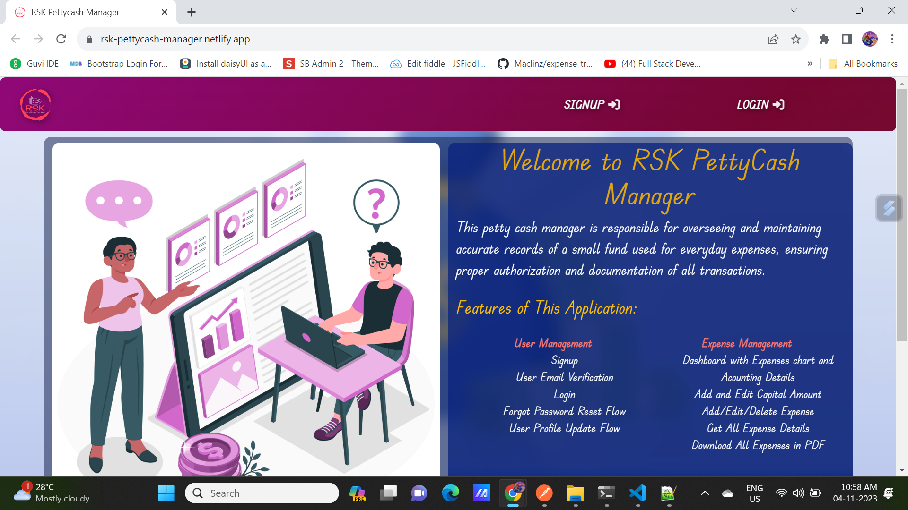

# RSK Pettycash Manager

The RSK Pettycash Manager is a web-based application designed to help individuals or small businesses manage their petty cash transactions efficiently. The application provides tools for tracking expenses, managing capital, and maintaining financial records.

## Features

- **Expense Management:** Users can add, edit, and delete their expenses, including details such as title, category, date, price, quantity, and description.
- **Capital Management:** Allows users to add and edit their capital amounts, providing an overview of their available funds.
- **Dashboard Overview:** Provides a comprehensive dashboard with detailed insights, including graphical representations of expenses and capital.
- **User Profile:** Users can manage their profiles, including personal details and avatars.
- **Responsive Design:** The application is designed to be responsive and works seamlessly on various devices and screen sizes.

## Technologies Used

- **Frontend:** React.js, Bootstrap, React Router
- **Backend:** Node.js, Express.js
- **Database:** MongoDB
- **Authentication:** JSON Web Tokens (JWT)
- **Additional Libraries:** Axios, jspdf, React Toastify

## Components and Pages

### Header

The Header component manages the application's top navigation bar. It includes the following elements:

- Brand logo link to the home page.
- Navigation links for Signup and Login, depending on the user's authentication status.
- Dashboard navigation with various options for managing expenses, capital, and user profile.
- User details and logout functionality.

### Footer

The Footer component represents the application's footer. It contains the following details:

- Copyright text and the developer's name.
- Social media links (LinkedIn and GitHub).

### Signup

The Signup component facilitates new user registration with the following functionalities:

- **Input Fields**:
  - Name, Email, Mobile Number, Password, and Avatar selection.
- **Avatar Selection**:

  - Users can select avatars from a pre-defined list.

- **Password Validation**:

  - Validates the password against specific criteria: at least 8 characters long, containing 1 uppercase letter, 1 number, and 1 symbol.

- **Submission and Verification**:
  - Submits the entered data for user registration.
  - Displays a waiting state for email verification with a redirect option for verifying email through OTP.

### Login

The Login component provides users with the ability to log into their accounts and includes the following functionalities:

- **Input Fields**:
  - Users can input their registered Email and Password to log in.
- **Password Recovery**:

  - Offers the option to reset the password via a "Forgot Password" link.

- **Authentication**:

  - Validates user credentials by sending the entered data to the backend for authentication.
  - On successful login, stores user details (Token, UserId, UserName, and Avatar) in local storage.

- **Navigation**:
  - Redirects users to the dashboard upon successful login.

### Password Reset Flow

#### Forgot Password

The Forgot Password component allows users to reset their password through the following functionalities:

- **Input Fields**:

  - Users can input their registered email to receive a One-Time Password (OTP) to reset the password.

- **Sending OTP**:
  - Sends a request to the backend to generate and dispatch the OTP to the provided email address.
  - Notifies the user upon successful or failed dispatch of the OTP.

#### Forgot Password Verification

The Forgot Password Verification component provides the means to verify the OTP and set a new password. It encompasses:

- **OTP Verification**:

  - Allows the user to enter the received OTP along with a new password.
  - Validates the format of the new password, ensuring it meets the required criteria.
  - Sends the OTP and the new password to the backend for verification and updates.

- **Error Handling**:
  - Informs the user of any errors in the OTP verification or password reset process.

### User Profile Update

#### Edit User Details

The Edit User Details component enables users to modify their personal details. It encompasses the following features:

- **Form Fields**:
  - Allows users to change their name, mobile number, email, and avatar.
- **Fetching User Data**:

  - Retrieves the existing user details to pre-fill the form fields for modification.

- **Sending OTP**:
  - Sends a One-Time Password (OTP) to the updated email address for verification.
- **Update User Details**:
  - Validates and updates the user's details upon successful OTP verification.

#### Edit User OTP Verification

The Edit User OTP Verification component validates the OTP received for modifying the user details. It includes:

- **Input OTP**:
  - Enables the user to input the OTP received on the updated email.
- **Update Confirmation**:
  - Verifies the OTP and updates the user details upon successful verification.
  - Provides an option to re-enter the OTP if it's incorrect or expired.

### Dashboard

The dashboard component offers a comprehensive view of key financial data in the application:

- **Capital Balance**: Displays the current balance of available capital.

- **Total Expense Amount**: Represents the accumulated expense amount.

- **Expense Transaction Count**: Shows the total count of expense transactions.

- **Line Chart Component**: The dashboard also incorporates a Line chart component, showcasing a visual representation of financial data for better analysis.

- **BarChart Component**: The dashboard also incorporates a barchart component, showcasing a visual representation day wise expenses.

### Add Capital

The Add Capital component facilitates the addition of capital to the petty cash system. Key features include:

- **Adding Capital**:
  - Allows authorized users to add capital to the system by specifying the amount.
- **Authentication Check**:
  - Verifies user credentials and redirects to the login page if not authenticated.

### Add Expense

The Add Expense feature enables users to input and register expenses. Its functionalities consist of:

- **Expense Input**:
  - Users can provide details such as title, category, date, price, quantity, and a description.
- **Authentication Verification**:
  - Ensures that only authenticated users can add expenses, redirecting to the login page if not verified.

### Edit Capital

The Edit Capital component enables users to modify the existing capital amount in the system. It includes:

- **Edit Capital Amount**:
  - Allows authorized users to input an updated capital amount for the system.
- **Authentication Check**:
  - Ensures users are authenticated before enabling capital amount modifications.

### Edit Expense

The Edit Expense feature facilitates the modification of existing expense details. Key aspects are:

- **Expense Details Update**:
  - Users can modify various details such as title, category, date, price, quantity, and description of an existing expense.
- **Authentication Verification**:
  - Ensures authorized access to edit expense details.

### All Expenses

The All Expenses component provides a comprehensive overview of the expenses recorded in the system. Its functionalities include:

- **Display All Expenses**:

  - Lists all recorded expenses, showcasing details such as title, category, date, description, price, quantity, and total price.

- **Search Functionality**:

  - Enables users to search expenses by title, category, or description using the search bar.

- **Export to PDF**:

  - Allows users to export all expense transactions to a PDF file.

- **Edit Expenses**:

  - Provides the ability to edit existing expenses, modifying various details.

- **Delete Expenses**:

  - Enables the removal of specific expense transactions after user confirmation.

- **Authentication Check**:
  - Ensures only authenticated users can view, edit, or delete expenses.

## Usage

To run the application locally:

1. Clone this repository.
2. Navigate to the project directory and install dependencies using `npm install`.
3. Start the frontend and backend servers using `npm start`.
4. Access the application in your web browser at `http://localhost:3000`.

## Deployment

The frontend is deployed on Netlify, and users can access the live application through [RSK Pettycash Manager](https://rsk-pettycash-manager.netlify.app/).

## Author

- **Shanmugam R.** - [GitHub](https://github.com/Shanmugamrskfamily)
